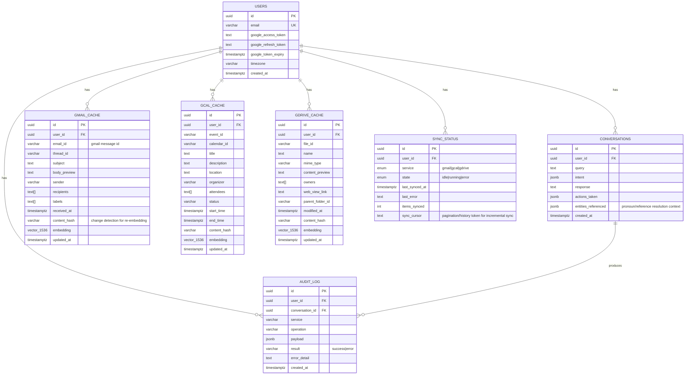

# Entity-Relationship Diagram

## Notes

- `gmail_cache` / `gcal_cache` / `gdrive_cache` are kept as separate tables rather than one
  polymorphic `documents` table: each has distinct filterable metadata (sender vs attendees vs
  mime_type) that benefit from dedicated btree/GIN indexes, and independent per-service sync jobs
  avoid write contention on a shared table.
- Every cache table carries a `content_hash` so the sync job can skip re-embedding unchanged items
  (embedding calls are the most expensive part of a sync pass).
- Every `*_cache` table has an `ivfflat` index on `embedding` with `vector_cosine_ops`, plus a
  composite `(user_id, <time column>)` btree index — queries always filter by `user_id` first
  (tenant isolation), so this index lets Postgres narrow the candidate set before the vector scan.
- `audit_log` is append-only and records every write operation (send/create/delete) executed by an
  agent, satisfying the security/compliance requirement for multi-tenant write auditing.
- `sync_cursor` stores Gmail `historyId` / Calendar `syncToken` / Drive `startPageToken` for
  incremental sync instead of re-scanning full mailboxes every 15 minutes.
